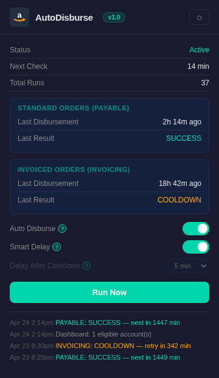
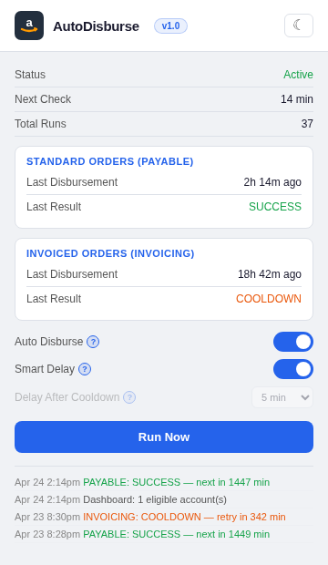

<p align="center">
  
  &nbsp;&nbsp;&nbsp;
  
</p>

<h1 align="center">AutoDisburse</h1>

<p align="center">
  <strong>Automatically request your Amazon Seller Central disbursements every 24 hours.</strong>
</p>

<p align="center">
  <a href="#installation">Install</a> · <a href="#how-it-works">How It Works</a> · <a href="#settings">Settings</a> · <a href="#faq">FAQ</a> · <a href="LICENSE">MIT License</a>
</p>

---

## What is AutoDisburse?

Amazon Seller Central lets you manually request early disbursement of your available balance, but enforces a 24-hour cooldown between requests. If you forget to click the button, your money sits in Amazon's account longer than it needs to.

AutoDisburse is a Chrome extension that handles this automatically. It checks your Seller Central dashboard, detects when your funds are eligible, navigates to the disbursement page, requests the transfer, reads Amazon's cooldown timer, and schedules the next attempt precisely when you're eligible again. No interaction required — just keep Chrome running.

It supports both account types independently:

- **Standard Orders (PAYABLE)** — your regular FBA/FBM sales
- **Invoiced Orders (INVOICING)** — Amazon Business / B2B invoiced transactions

Each has its own 24-hour cooldown tracked separately, so one won't block the other.

## Features

- **Fully autonomous** — runs in background tabs with zero interaction needed
- **Dual account tracking** — PAYABLE and INVOICING managed independently
- **Precise scheduling** — reads Amazon's server-side cooldown timer and schedules to the minute
- **Smart Delay** — weighted RNG picks a random 2–8 min post-cooldown delay based on your last 5 runs, so timing never falls into a pattern
- **Configurable delay** — or set a fixed delay (2–60 min) after cooldown expires
- **Natural interaction model** — uses Chrome DevTools Protocol for hardware-level input events with realistic mouse movement, Bézier curve pathing, and weighted timing distributions
- **Light & dark mode** — toggleable theme with branded UI
- **Activity log** — last 12 events shown in popup, 100 stored
- **Desktop notifications** — alerts on success, cooldown, or errors
- **Session detection** — detects expired Seller Central sessions and notifies you to log back in
- **Open source** — MIT licensed, no telemetry, no external calls

## Installation

1. Download or clone this repository:
   ```bash
   git clone https://github.com/cjmedia72/amazon-auto-disburse.git
   ```

2. Open Chrome and navigate to `chrome://extensions`

3. Enable **Developer mode** (toggle in the top right)

4. Click **Load unpacked** and select the cloned folder

5. Log into [Amazon Seller Central](https://sellercentral.amazon.com) and make sure your session is active

6. Click the AutoDisburse icon in your extensions toolbar to verify it shows "Active"

That's it. Leave Chrome running and the extension handles the rest.

> **Optional:** Launch Chrome with the `--silent-debugger-extension-api` flag to suppress the debugger info bar that briefly appears when the extension interacts with a page. This is cosmetic only — the bar appears on background tabs for ~2 seconds and auto-closes.

## How It Works

AutoDisburse uses a two-phase sensor/actuator architecture:

### Phase 1: Dashboard Sensor

Every 30 minutes (or at precise cooldown expiry), the extension opens your Seller Central payments dashboard in a background tab. A content script reads each account type's available balance and checks whether the "Request Payment" button is enabled. It reports back to the service worker and the tab closes automatically.

### Phase 2: Detail Page Sensor + CDP Actuator

For each eligible account, the extension opens the disbursement detail page. A content script acts as a read-only sensor — it locates the "Request Transfer" button and reports its coordinates back to the service worker. The service worker then:

1. Briefly activates the tab
2. Simulates a full page browsing session — mouse enters from a random viewport edge, visits 2–4 points of interest along Bézier curves with natural deceleration, idles with small drift while "reading," occasionally scrolls
3. Navigates the cursor toward the target button with a curved approach path, including occasional mid-approach pauses and overshoot corrections
4. Performs a hardware-level click via Chrome DevTools Protocol (`Input.dispatchMouseEvent`) producing `isTrusted: true` events with realistic press-hold-release timing
5. Polls the existing DOM for success/error confirmation (no page reload)
6. Parses the cooldown timer and schedules the next attempt

All timing uses a weighted random distribution (averaged triple `Math.random()`) that clusters values toward the center rather than producing flat uniform randomness. Every session generates a unique movement pattern.

### Safety Measures

- **Processing lock** — prevents overlapping runs (auto-expires after 2 minutes)
- **Safety timeout** — tabs are force-closed after 40–55 seconds if a content script doesn't respond
- **Sequential processing** — detail pages open one at a time with randomized gaps
- **No external requests** — extension only interacts with Seller Central pages you're already logged into

## Settings

| Setting | Default | Description |
|---------|---------|-------------|
| **Auto Disburse** | On | Master switch — enables/disables all automatic disbursement |
| **Smart Delay** | On | Weighted RNG picks 2–8 min delay based on last 5 runs. Overrides fixed delay when enabled |
| **Delay After Cooldown** | 5 min | Fixed delay after Amazon's 24hr cooldown expires. Only active when Smart Delay is off |

### Smart Delay vs. Fixed Delay

**Smart Delay** tracks the last 5 delay values it picked and weights the next pick toward values it hasn't used recently. This prevents the extension from falling into a predictable timing pattern. When Smart Delay is enabled, the "Delay After Cooldown" dropdown is greyed out.

**Fixed Delay** lets you set a specific number of minutes (2, 3, 4, 5, 7, 10, 15, 20, 30, 45, or 60) to wait after the cooldown expires. Useful if you want deterministic timing.

## Permissions

| Permission | Why |
|------------|-----|
| `alarms` | Schedule heartbeat checks and precise retry timers |
| `tabs` | Open/close background tabs for dashboard and detail pages |
| `notifications` | Desktop alerts for disbursement results |
| `storage` | Persist settings, cooldown state, and activity log |
| `debugger` | Chrome DevTools Protocol access for hardware-level input events |
| `sellercentral.amazon.com` | Content scripts read the dashboard and detail pages |

The extension makes **zero external network requests**. It only interacts with Amazon Seller Central pages that you're already logged into.

## File Structure

```
amazon-auto-disburse/
├── manifest.json        # Chrome MV3 extension config
├── background.js        # Service worker — heartbeat, alarms, CDP actuator, page presence simulation
├── dashboard.js         # Content script — reads payment dashboard (sensor only)
├── disburse.js          # Content script — locates transfer button, reports coordinates (sensor only)
├── popup.html           # Extension popup UI
├── popup.js             # Popup logic — settings, status display, log viewer
├── icon16.png           # Toolbar icon
├── icon48.png           # Extension management icon
├── icon128.png          # Chrome Web Store icon
├── LICENSE              # MIT
└── screenshots/
    ├── dark-mode.png
    └── light-mode.png
```

## FAQ

**Does this work with multiple seller accounts?**
It works with whichever account is currently logged in. If you have multiple accounts, it will disburse from whichever session is active in Chrome.

**What happens if my session expires?**
The dashboard content script detects session expiry and sends a desktop notification telling you to log back in. The extension will retry on the next heartbeat cycle (30 minutes).

**Does it work if Chrome is minimized?**
Yes. The extension uses background tabs and Chrome's alarm API, which runs regardless of window state. Chrome just needs to be running.

**What if there's a $0 balance?**
The dashboard sensor checks balances before proceeding. If an account has $0 available, it skips that account type and logs it.

**Can I trigger a manual run?**
Yes — click the "Run Now" button in the popup. It bypasses all cooldown checks and processes both account types immediately.

**What is the debugger info bar?**
Chrome shows a brief yellow info bar when an extension uses the DevTools Protocol. It appears on background tabs for ~2 seconds during each disbursement cycle. You can suppress it by launching Chrome with `--silent-debugger-extension-api`.

**Is this compliant with Amazon's Terms of Service?**
No. Use at your own risk.

Amazon's Business Solutions Agreement (BSA) — specifically the Prohibited Seller Activities section and the AI Agent Policy updated March 4, 2026 — prohibits unauthorized automation that interacts with Seller Central outside of Amazon's official SP-API. AutoDisburse operates directly in your browser session and is not an authorized integration. Amazon could flag, warn, or suspend your account if they detect it.

**What's the actual risk?**
The disbursement button is a legitimate action you are entitled to take as a seller. AutoDisburse does nothing you couldn't do manually — it just does it on a schedule so you don't forget. Amazon's enforcement attention around automation has historically focused on review manipulation, listing scraping, and pricing bots. There are no known reports of sellers being actioned for automating their own disbursement requests. That said, Amazon's policies give them broad discretion, and that could change. If account health is a concern, use the manual "Run Now" button instead of leaving it on auto.

**If it's against TOS, why build it?**
Because the action itself — requesting your own disbursement — is completely legitimate. Amazon imposes a 24-hour cooldown between requests, and if you forget to click the button, your money sits in their account longer than it needs to. That's a workflow problem, not a policy one. This tool exists to solve it. What you do with it is your call.

**How does it mimic human behavior?**
Most browser automation tools use synthetic clicks that produce `isTrusted: false` events — a flag that any detection script can read to immediately identify non-human input. AutoDisburse takes a different approach.

The extension uses Chrome's DevTools Protocol to dispatch `Input.dispatchMouseEvent` calls at the hardware driver level, producing `isTrusted: true` events — the same flag set by a physical mouse. Before the cursor ever reaches the button, the extension runs a full simulated browsing session: the mouse enters the viewport from a random edge, travels along Bézier curves to 2–4 natural reading points with Fitts's Law deceleration, idles with small random drift while "reading," occasionally scrolls, then curves toward the target button with a mid-approach pause and an overshoot correction before settling on the click target. Press, hold, and release timings are randomized with a weighted distribution that clusters toward natural human reaction times rather than machine-flat intervals.

Every session generates a unique movement pattern. At the input-event level, the interaction is indistinguishable from a person sitting at the keyboard.

## Requirements

- Google Chrome (or Chromium-based browser)
- Active Amazon Seller Central session
- Chrome running in the background

## Contributing

PRs welcome. If you find a selector that Amazon has changed, open an issue with the new HTML structure and I'll update the content scripts.

## License

[MIT](LICENSE) © 2026 CJ MEDIA
